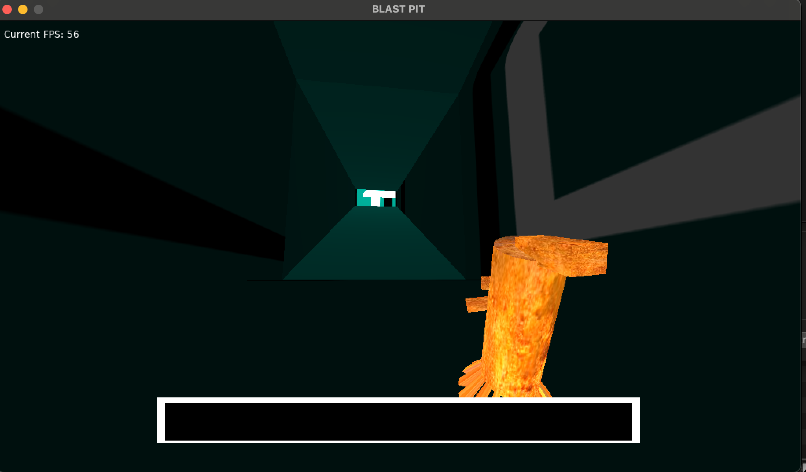

# BLAST PIT
Blast pit is an ultrakill inspried fps that I'm currently developing with Jayden working on music. As of right now this is an early demo of the movement and general feel of the game. I haven't added any animations but the game is fully playable, you can win and there is credits.

Visually the game is lackluster as of right now, I'm working on a new shader for it but this is just what I could hack together.

I would be remiss if I didn't mention this, I have overhauled the graphics but I got swamped with work and I have to push a patch for different resolutions. This dev version is very buggy atm, so you can only run it via the love cli. To do it download love, then run. Sorry for the inconvience but making bianaries is absolute pain.
```
git clone https://github.com/NikolasDaynard/Menori-FPS
love ~/path/to/cloned/repo
```




Thank you to the poeple working on g3d, without them I could never do 3d in lua. Sending them lots of LÖVE.

Please enjoy!

Itch page:
https://coding-person.itch.io/blast-pit
